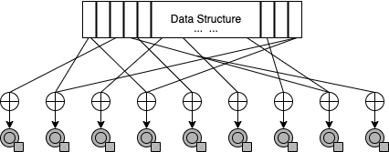

# VaultBox      

## Compilation
    g++ -I/usr/local/include -L/usr/local/lib test.cpp lib.cpp -lcryptopp

## About

$VaultBox$ is a header-only C++ library to provide forward-secure, replicated, randomized, and rate-less, storage and transmission. We propose three levels of security for data protection.

(i) To use $VaultBox$ buffer secured by Authenticated Encryption to provide data security at rest.

(ii) To use Falcon encoding to provide data protection in transit.

(iii) To use (optionally) secure chips like Trusted Platform Module (TPM) / Trusted Execution Environment (TEE) and secure memory like Error Correcting Code - Random Access Memory (ECC-RAM) and Persistent Memory (P-Mem) for an extra layer of security. (API support is not implemented in this library.)

## Secure Data Structure

The data structure $\mathcal{DS}$ (secure buffer) is a fixed size structure with size $T = k \cdot n$, which holds $k$ replicas of $n$ messages. The sender sends this data to the receiver every $x$ minutes; if the receiver does not receive it during this interval, it suggests an attack or a crash. Therefore, $\mathcal{DS}$ should be large enough to hold all possible messages during that $x$ minutes interval.

Replicas of a message inside the $\mathcal{DS}$ are stored at random locations generated by a PRNG. For example, consider a $\mathcal{DS}$ that holds 1024 messages, each message being 32kB, then such a $\mathcal{DS}$ would be of size 32MB. $\mathcal{DS}$ is initialized with noise to avoid trivial detection from locations containing messages to locations without it.

To protect the messages in transit, we use the Falcon encoding scheme. Our rate-less scheme assumes a highly adversarial channel $C$ where the attacker can eavesdrop or delete the messages. First, we break the sealed (encrypted) $\mathcal{DS}$ into message blocks and apply LT encoding with a weak PRNG, and then we use the Authenticated Encryption scheme to generate output to transmit. The receiver has to collect enough chunks (or symbols) for regenerating the sealed $\mathcal{DS}$ and unsealing (decrypting) it to read and verify the data inside it. The inner layer for individual messages and the outer layer for the buffer containing all messages provides two layers of encryption protection over plaintext.

## Integrity Checker

After adding each message to $\mathcal{DS}$ for the session, the sender updates and stores the hash value calculated and updated from each message for the session, which the $IntegrityChecker$ periodically compares with the hash value computed from the current contents of the buffer. An alert $\Psi$ is sent if the hash values do not match.

## Encoder \& Decoder

These components convert the secure buffer messages to secure symbols (Falcon codes) and vice-versa. However, they do not modify the existing transmission channel $C$.

## Verifier

This component comprises a couple of security checks at a receiver.

First, the $Verifier$ alerts, if Authenticated Decryption for any symbol or message, fail for the current session.

Second, $SequenceChecker$ sends alert $\Psi$ for any gaps in the sequence numbers.

Third, if replication factor $r > 1$, $IdentityChecker$ is used to check if the two messages with the same sequence number are identical; if not, $\Psi$ is sent, indicating a potential compromise.

Finally, since the cryptographic keys are stored for each index between sessions, $Verifier$ also checks (re-verification for previous messages) the buffer contents if it includes any messages from prior sessions and sends $\Psi$ if Authenticated Decryption fails for any of these messages.

## Key Evolution

The outer layer key for symbols, $K_S$, is forward-securely updated with a hash function for every session. $K_S$ generates a Nonce value using a PRNG to shuffle the indices of messages to be XORed. The inner layer key for the session, $K_M$, is forward-securely generated using a KeyGen function $KeyGen(K_S)$. Every message in the buffer $K_M$ is hashed to generate message-specific keys $k_{ENC}$ and $k_{HMAC}$ for Authenticated Encryption. After all the messages are encrypted and stored in the buffer, $k_{ENC}$ and $k_{HMAC}$ are generated using $K_S$ for Authenticated Encryption of symbols.

### Forward-secure Key Generation

    For every session
        K_S <- Hash(K_S)
        Nonce <- PRNG(K_S)
        K_M <- KeyGen(K_S)
        For every message M
            K_M <- Hash(K_M)
            k_{ENC}, k_{HMAC} <- K_M     {inner layer key}
            M_{AE} <- AuthEnc(M, k_{ENC}, k_{HMAC})
        End For
        k_{ENC}, k_{HMAC} <- K_S         {outer layer key}
        For every symbol S
            S_{AE} <- AuthEnc(S, k_{ENC}, k_{HMAC})
        End For
    End For
